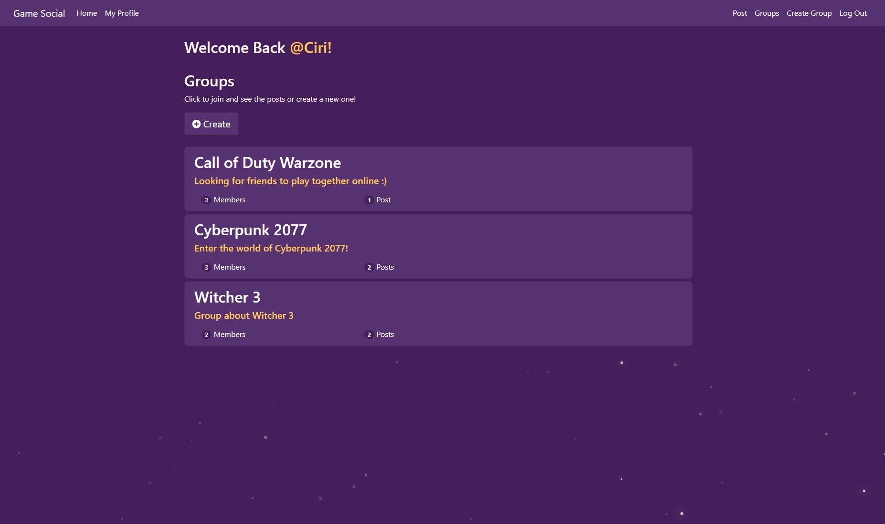
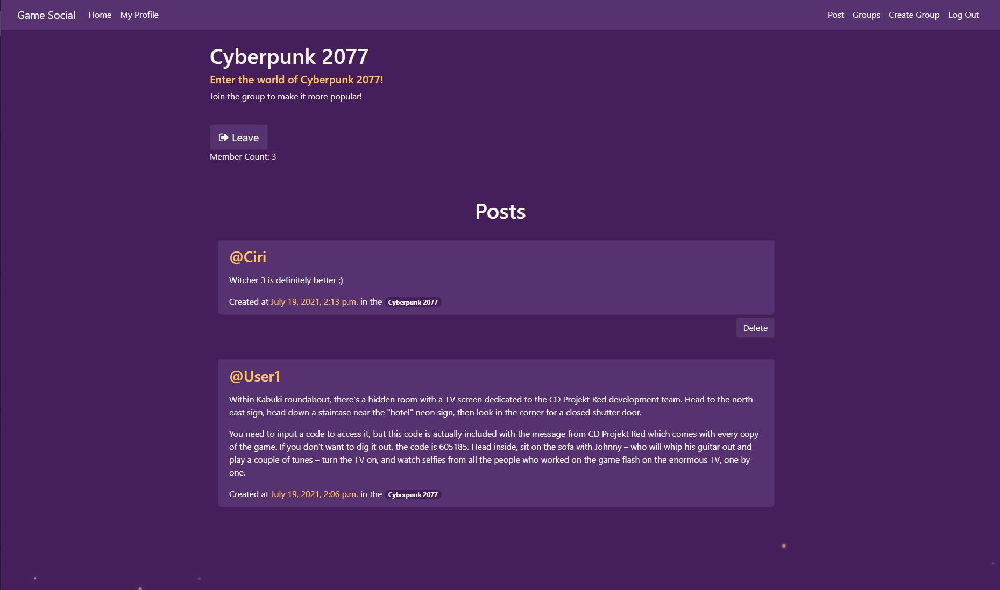
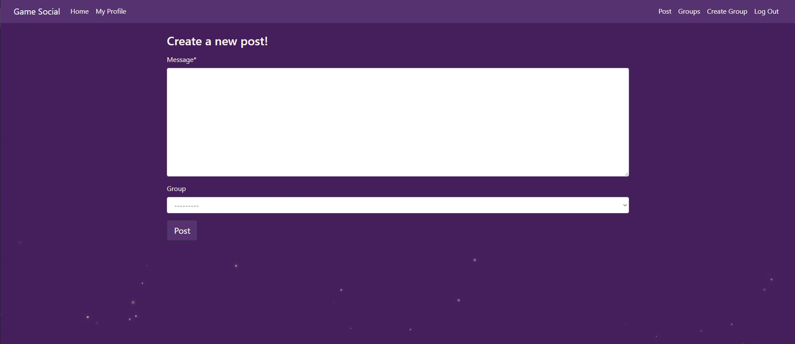

# Game-Social
Available on https://game-social.herokuapp.com

## Table of contents
* [General info](#general-info)
* [Technologies](#technologies)
* [Installation](#installation)
* [Screenshots](#screenshots)

## General info
A social networking site that allows you to create a group and post in it.
	
## Technologies
Project is created with:
* Python
* Django
* HTML
* CSS
* JS
* Bootstrap

## Installation
1) Create virtual environment

    ```
    python -m venv venv
    ```
    On linux:
    ```
    source venv/bin/activate
    ```
    On windows (cmd):
    ```
    venv\Scripts\activate.bat
    ```
2) Install prerequisites
   ```
   pip install -r requirments.txt
   ```
3) Go to socialmedia
4) Run django
    ```
    python manage.py runserver
    ```
5) To check your application go to [localhost](http://127.0.0.1:5000/)

<!-- ## Screenshots
* **Home Page** 


* **Groups**

* **Group View**


* **Posts**


* **Profile**
 -->
